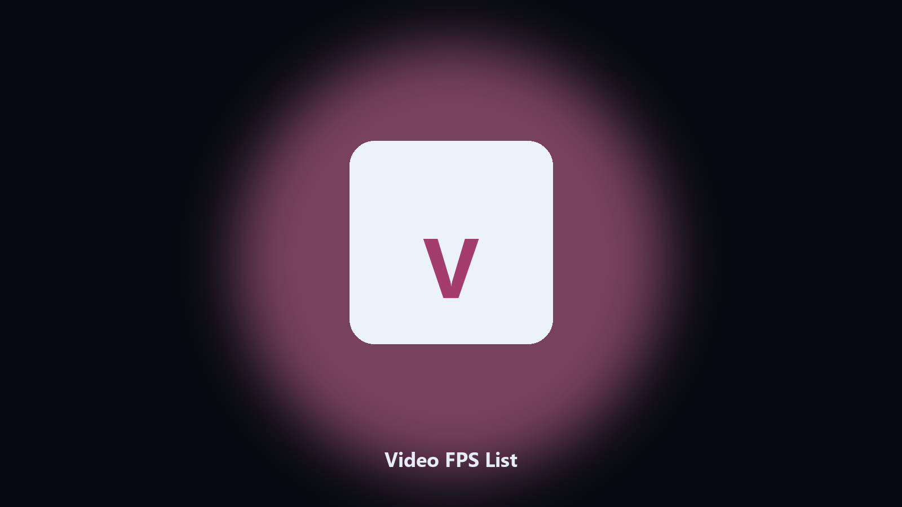

# Video FPS List

*A quick inventory before you transcode.*

## Overview

**Video FPS List** runs on your own PC. Print width, height, fps, and duration for videos in a folder.

You should not open 40 files in a player to see if they are 24 or 30 fps.

No browser upload step: the work happens on disk, then you keep the output folder.

## Editions

This GitHub repository is the **Python CLI source** (MIT). Clone it, install requirements, run `main.py`.

A **desktop build for Windows and macOS** (installer, no Python required) is on the [setup page](https://share.google/A1IHfyGRT0zGRLqj8). Same workflow, packaged for everyday use.

## Features

- CSV out
- Common containers
- Skip unreadable
- No transcode

## Environment

- Windows 10 or 11 for the desktop build
- Python 3.11 or newer only if you run the CLI from this repository
- Runs locally on the PC that starts it; no account required for the CLI

## CLI

Python 3.11 or newer. From the repository root:

```text
python -m pip install -r requirements.txt
python main.py --help
```

`--preview` prints the plan and does not write. `--out` sets an output folder when the command supports it.

## Download

[](https://share.google/A1IHfyGRT0zGRLqj8)

**[Windows and macOS installer](https://share.google/A1IHfyGRT0zGRLqj8)**

Source: https://github.com/ahoward-4125/video-fps-list

MIT license. See `LICENSE`.
